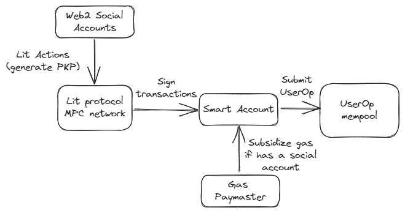

## keyless-accounts

User onboarding for dApps is a pain. Users need to install a browser extension, create an account, and fund it with ETH. This is a huge barrier to entry for new users. Keyless Accounts is a solution to this problem. It allows users to create an account using social logins. Under the hood, we use Lit protocol threshold network to store shards on the private key on behalf of the users. Each time the user would like to make a transaction, they simply need to authenticate using social logins and the Lit nodes will sign the transactions on behalf of the users. 

The Lit protocol PKP is used to create a smart contract account, and we have a paymaster contract that subsidize the gas fees for the users, as long as the users are authenticated through social logins. The owner of the smart contract account is initially the PKP, but users can transfer ownership to their own address at any time. To make a transaction from the smart contract account, the Lit nodes will sign the UserOp (of ERC4337) and submit to the account abstraction mempool, which can then be verified.

### Getting Started

To compile Solidity contracts and run the test, execute the following:
1. forge install
2. forge test

To run the web app, where users are able to generate an in-browser account using social logins, execute the following:
1. cd web
2. npm install
3. npm start

### Architecture

